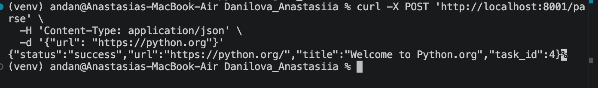
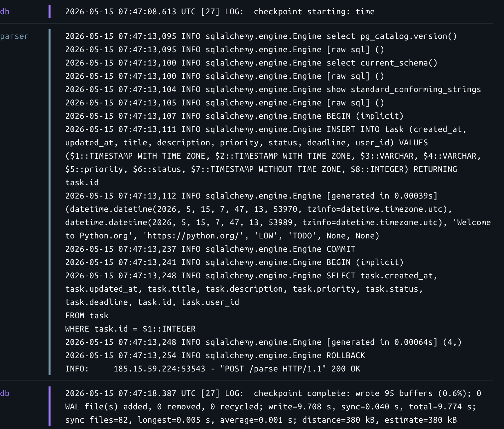
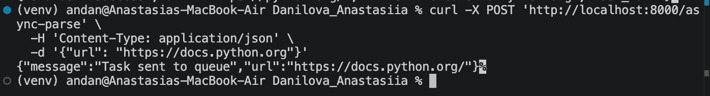
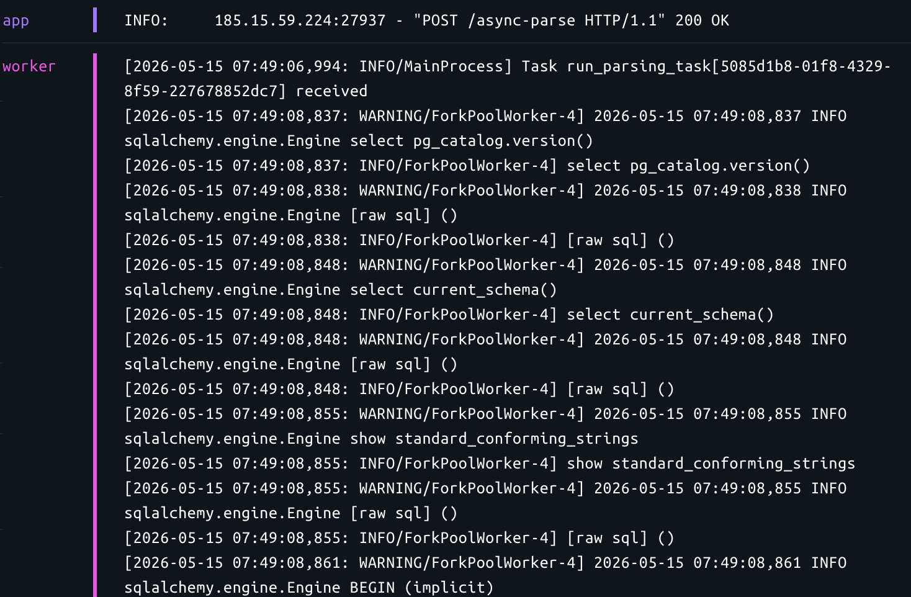
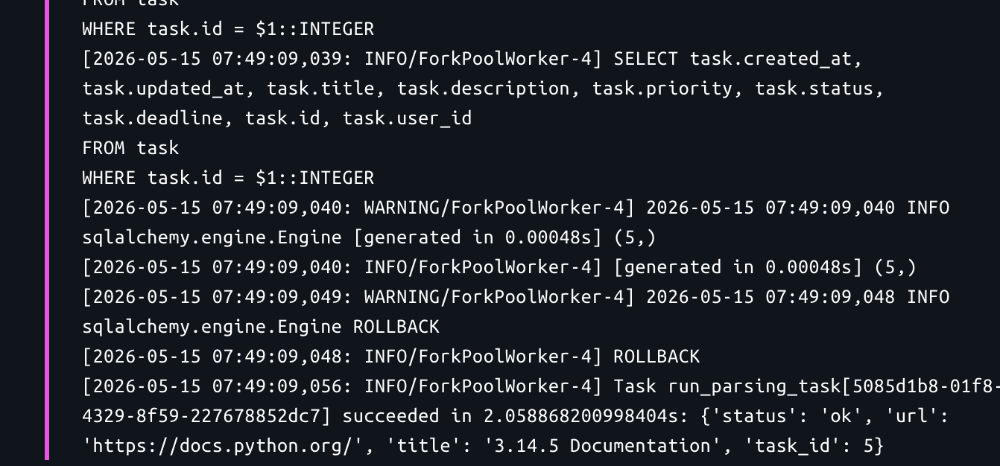
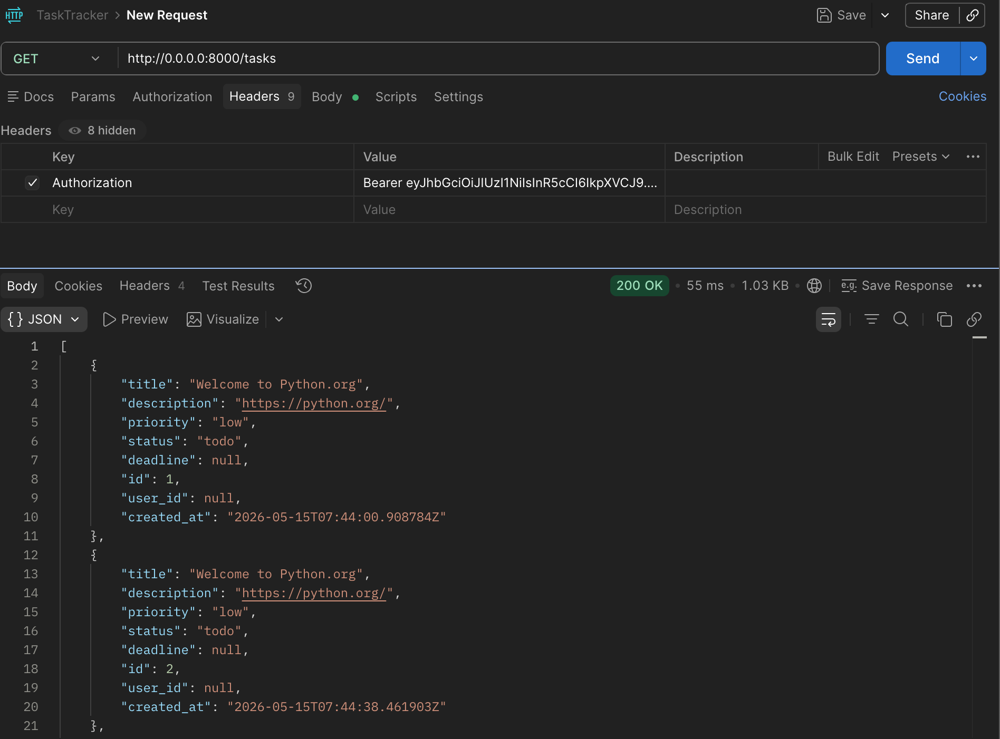
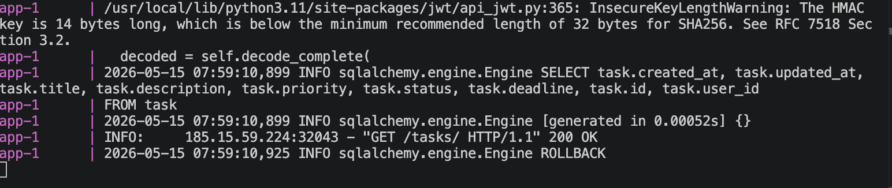

# Лабораторная работа 3. Упаковка FastAPI приложения в Docker, Работа с источниками данных и Очереди.

## Цели
Научиться упаковывать FastAPI приложение в Docker, интегрировать парсер данных с базой данных и вызывать парсер через API и очередь.

## Выполннение

## 1. Описание реализации
1. Архитектура контейнеризации
Система разделена на 5 сервисов в docker-compose.yml:

db: PostgreSQL (хранение задач). Настроен healthcheck для предотвращения ошибок старта зависимых сервисов.

redis: Брокер сообщений для Celery.

app: Основной API. Использует PYTHONPATH=/srv для доступа к ядру core.

parser: Изолированный микросервис для парсинга, доступный по HTTP.

worker: Экземпляр приложения, запускающий Celery-воркер для фоновых задач.

## 2. Реализация парсера (Микросервис)
Парсер реализован с использованием aiohttp для асинхронных сетевых запросов и BeautifulSoup4 для извлечения заголовка страницы. Для предотвращения перегрузки целевых ресурсов применен asyncio.Semaphore(5), ограничивающий количество одновременных подключений.

## 3. Асинхронная очередь (Celery + Redis)
Для реализации Подзадачи 3 в файле celery_app.py настроен экземпляр Celery.

Workflow: При поступлении запроса на /async-parse в основном приложении, задача run_parsing_task помещается в Redis.

Execution: Воркер подхватывает задачу и запускает асинхронный событийный цикл (asyncio.run) для выполнения парсинга и записи в БД, не блокируя основной поток API.

## Вывод
В результате выполнения работы была создана масштабируемая система, упакованная в Docker. Приложение соответствует принципам микросервисной архитектуры: сервисы имеют общую бизнес-логику (core), но независимые среды исполнения и ответственности.

## Демонстрация работы

1. Прямой вызов микросервиса парсера (Подзадача 2)
Демонстрирует работу отдельного контейнера parser.

```Bash
curl -X POST 'http://localhost:8001/parse' \
  -H 'Content-Type: application/json' \
  -d '{"url": "https://python.org"}'
```
**Результат:**



**Логи контейнера:**



2. Асинхронный вызов через основной API 


```Bash
curl -X POST 'http://localhost:8000/async-parse' \
  -H 'Content-Type: application/json' \
  -d '{"url": "https://docs.python.org"}'
```
**Результат:**



**Логи контейнера:**





3. Проверка записи в БД 
Подтверждает, что данные успешно прошли путь от парсинга до сохранения в Postgres.

**Результат:**



**Логи контейнера:**


