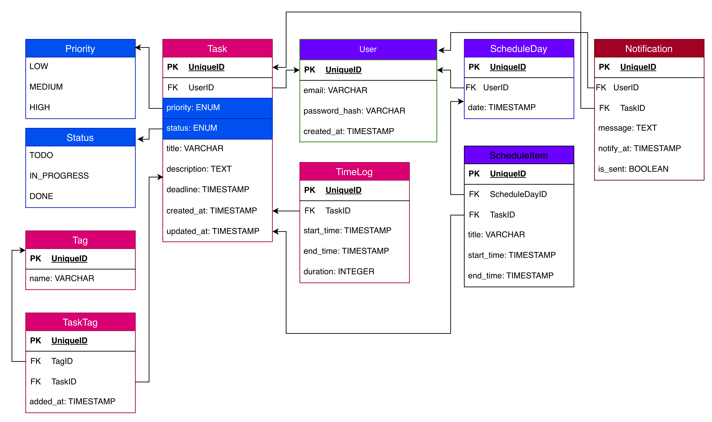

### Сущности 

Для начала были выделены основные сущности и составлена примерная ER-диаграмма:



Далее была настроена структура проекта, импортированы необходимые библиотеки и созданы файлы моделей:


#### **user.py**
Файл юзера это сущность пользователя, которая имеет несколько классов под разные эндпоинты:

- UserBase(SQLModel) - основные поля, от этого класса будут наследоваться остальные;
- UserCreate(UserBase) - для ручки POST, остальные поля берет из суперкласса;
- UserUpdate(SQLModel) - для ручки PATCH, где все поля необязательные;
- UserLogin(SQLModel) - для логина;
- PasswordChange(SQLModel) - для смены пароля;
- Token(SQLModel) - отдельный класс токена для JWT аутентификации;
- User(UserBase, TimestampMixin, table=True) - для ОРМ;
- UserPublic(UserBase) - краткая версия для отправки в ответке АПИ;
- UserWithTasks(UserPublic) - Для вывода с вложенными сущностями.

Такая идея разделения по классам была взята, вдохновившись [этим проектом](https://github.com/fastapi/full-stack-fastapi-template/blob/master/backend/app/models.py).


```python
from datetime import datetime
from typing import Optional, List

from pydantic import EmailStr
from sqlmodel import SQLModel, Field, Relationship

from db.models.mixins import TimestampMixin

from typing import TYPE_CHECKING
if TYPE_CHECKING:
    from db.models.notification import Notification
    from db.models.schedule import ScheduleDay
    from db.models.tag import Tag
    from db.models.task import Task

# base class
class UserBase(SQLModel):
    name: str
    email: EmailStr = Field(unique=True, index=True)

# takes fields from superclass
class UserCreate(UserBase):
    password: str

# all fields are optional for correct update
class UserUpdate(SQLModel):
    email: Optional[EmailStr] = None
    name: Optional[str] = None
    password: Optional[str] = None


class UserLogin(SQLModel):
    email: EmailStr
    password: str


class PasswordChange(SQLModel):
    current_password: str
    new_password: str


class Token(SQLModel):
    access_token: str
    token_type: str = "bearer"

# for ORM
class User(UserBase, TimestampMixin, table=True):
    id: Optional[int] = Field(default=None, primary_key=True)
    is_active: bool = Field(default=True)

    hashed_password: str

    # relations
    tasks: List["Task"] = Relationship(
        back_populates="user", sa_relationship_kwargs={"cascade": "all, delete"}
    )
    notifications: List["Notification"] = Relationship(
        back_populates="user", sa_relationship_kwargs={"cascade": "all, delete"}
    )
    schedule_days: List["ScheduleDay"] = Relationship(
        back_populates="user", sa_relationship_kwargs={"cascade": "all, delete"}
    )

# for API response
class UserPublic(UserBase):
    id: int
    created_at: datetime

# for inner entities
class UserWithTasks(UserPublic):
    tasks: List["Task"] = []


```

По такой же логике сощданы классы и для остальных сущнойстей:

#### **timelog.py**

```python
from datetime import datetime
from typing import Optional

from sqlmodel import SQLModel, Field, Relationship

from typing import TYPE_CHECKING
if TYPE_CHECKING:
    from db.models.task import Task
    

class TimeLogBase(SQLModel):
    start_time: datetime
    end_time: Optional[datetime] = None
    duration: Optional[int] = None  # in minutes


class TimeLogCreate(TimeLogBase):
    task_id: int


class TimeLogUpdate(SQLModel):
    start_time: Optional[datetime] = None
    end_time: Optional[datetime] = None
    duration: Optional[int] = None


class TimeLog(TimeLogBase, table=True):
    id: Optional[int] = Field(default=None, primary_key=True)

    task_id: int = Field(foreign_key="task.id")
    task: Optional[Task] = Relationship(back_populates="time_logs")


class TimeLogPublic(TimeLogBase):
    id: int
    task_id: int


```

#### **task.py**

```python
from datetime import datetime
from enum import Enum
from typing import Optional, List

from sqlmodel import SQLModel, Field, Relationship

from db.models.mixins import TimestampMixin

from db.models.tag import TaskTag

from typing import TYPE_CHECKING

if TYPE_CHECKING:
    from db.models.notification import Notification
    from db.models.schedule import ScheduleItem
    from db.models.tag import Tag
    from db.models.timelog import TimeLog
    from db.models.user import User


class Priority(Enum):
    LOW = "low"
    MEDIUM = "medium"
    HIGH = "high"


class Status(Enum):
    TODO = "todo"
    IN_PROGRESS = "in_progress"
    DONE = "done"


# base class
class TaskBase(SQLModel):
    title: str
    description: Optional[str] = None
    priority: Priority = Field(default=Priority.LOW)
    status: Status = Status.TODO
    deadline: Optional[datetime] = None


# takes fields from superclass
class TaskCreate(TaskBase):
    user_id: Optional[int] = None


# all fields are optional for correct update
class TaskUpdate(SQLModel):
    title: Optional[str] = None
    description: Optional[str] = None
    priority: Optional[Priority] = None
    status: Optional[Status] = None
    deadline: Optional[datetime] = None


# for ORM
class Task(TaskBase, TimestampMixin, table=True):
    id: Optional[int] = Field(default=None, primary_key=True)

    user_id: Optional[int] = Field(default=None, foreign_key="user.id")
    user: Optional[User] = Relationship(back_populates="tasks")

    # relationships
    time_logs: List["TimeLog"] = Relationship(
        back_populates="task", sa_relationship_kwargs={"cascade": "all, delete"}
    )
    notifications: List["Notification"] = Relationship(
        back_populates="task", sa_relationship_kwargs={"cascade": "all, delete"}
    )
    schedule_items: List["ScheduleItem"] = Relationship(
        back_populates="task", sa_relationship_kwargs={"cascade": "all, delete"}
    )

    tags: List["Tag"] = Relationship(back_populates="tasks", link_model=TaskTag)


# for API response
class TaskPublic(TaskBase):
    id: int
    user_id: Optional[int] = None
    created_at: datetime


# for inner entities
class TaskFull(TaskPublic):
    time_logs: List["TimeLog"] = []
    tags: List["Tag"] = []


```

#### **tag.py**

```python
from datetime import datetime, timezone
from typing import Optional, List

from sqlmodel import SQLModel, Field, Relationship

from typing import TYPE_CHECKING
if TYPE_CHECKING:
    from db.models.task import Task

class TaskTag(SQLModel, table=True):
    task_id: Optional[int] = Field(
        default=None, foreign_key="task.id", primary_key=True
    )
    tag_id: Optional[int] = Field(default=None, foreign_key="tag.id", primary_key=True)
    added_at: datetime = Field(default_factory=lambda: datetime.now(timezone.utc))


class TaskTagCreate(SQLModel):
    task_id: int
    tag_id: int


class TaskTagUpdate(SQLModel):
    added_at: Optional[datetime] = None


class TaskTagPublic(SQLModel):
    task_id: int
    tag_id: int
    added_at: datetime


class TagBase(SQLModel):
    name: str


class TagCreate(TagBase):
    pass


class TagUpdate(SQLModel):
    name: Optional[str] = None


class Tag(TagBase, table=True):
    id: Optional[int] = Field(default=None, primary_key=True)

    tasks: List["Task"] = Relationship(back_populates="tags", link_model=TaskTag)


class TagPublic(TagBase):
    id: int


```

#### **schedule.py**

```python
from datetime import datetime, timezone
from typing import Optional, List

from sqlmodel import SQLModel, Field, Relationship

from db.models.mixins import TimestampMixin

from typing import TYPE_CHECKING

if TYPE_CHECKING:
    from db.models.task import Task
    from db.models.user import User


class ScheduleDayBase(SQLModel):
    date: datetime = Field(default_factory=lambda: datetime.now(timezone.utc))


class ScheduleDayCreate(ScheduleDayBase):
    user_id: Optional[int] = None


class ScheduleDayUpdate(ScheduleDayBase):
    date: Optional[datetime] = None


class ScheduleDay(ScheduleDayBase, TimestampMixin, table=True):
    id: Optional[int] = Field(default=None, primary_key=True)

    user_id: Optional[int] = Field(default=None, foreign_key="user.id")
    user: Optional[User] = Relationship(back_populates="schedule_days")

    schedule_items: List["ScheduleItem"] = Relationship(
        back_populates="schedule_day", sa_relationship_kwargs={"cascade": "all, delete"}
    )


class ScheduleDayPublic(ScheduleDayBase):
    id: int
    user_id: Optional[int] = None
    date: Optional[datetime] = None


class ScheduleItemBase(SQLModel):
    title: str
    start_time: Optional[datetime] = Field(default_factory=lambda: datetime.now(timezone.utc))
    end_time: Optional[datetime] = None


class ScheduleItemCreate(ScheduleItemBase):
    schedule_day_id: Optional[int] = None
    task_id: Optional[int] = None


class ScheduleItemUpdate(SQLModel):
    title: Optional[str] = None
    start_time: Optional[datetime] = None
    end_time: Optional[datetime] = None


class ScheduleItem(ScheduleItemBase, table=True):
    id: Optional[int] = Field(default=None, primary_key=True)

    schedule_day_id: Optional[int] = Field(default=None, foreign_key="scheduleday.id")
    schedule_day: Optional[ScheduleDay] = Relationship(back_populates="schedule_items")

    task_id: Optional[int] = Field(default=None, foreign_key="task.id")
    task: Optional["Task"] = Relationship(back_populates="schedule_items")


class ScheduleItemPublic(ScheduleItemBase):
    id: int
    schedule_day_id: Optional[int] = None
    task_id: Optional[int] = None


```


#### **notification.py**

```python
from datetime import datetime, timezone
from typing import Optional

from sqlmodel import SQLModel, Field, Relationship

from typing import TYPE_CHECKING

if TYPE_CHECKING:
    from db.models.task import Task
    from db.models.user import User

class NotificationBase(SQLModel):
    message: str
    notify_at: datetime = Field(default_factory=lambda: datetime.now(timezone.utc))
    is_sent: bool = False


class NotificationCreate(NotificationBase):
    user_id: Optional[int] = None
    task_id: Optional[int] = None


class NotificationUpdate(SQLModel):
    message: Optional[str] = None
    notify_at: Optional[datetime] = None
    is_sent: Optional[bool] = None


class Notification(NotificationBase, table=True):
    id: Optional[int] = Field(default=None, primary_key=True)

    user_id: Optional[int] = Field(default=None, foreign_key="user.id")
    user: Optional["User"] = Relationship(back_populates="notifications")

    task_id: Optional[int] = Field(default=None, foreign_key="task.id")
    task: Optional["Task"] = Relationship(back_populates="notifications")


class NotificationPublic(NotificationBase):
    id: int
    user_id: Optional[int] = None
    task_id: Optional[int] = None
    notify_at: datetime


```

Также в целях соблюдения принципа DRY для полей updated_at и created_at был создан файл, где прописано присвоенине времени этим полям. 

#### **mixins.py**

```python

from datetime import datetime, timezone
from sqlalchemy import DateTime
from sqlalchemy.sql import func
from sqlmodel import SQLModel, Field


class TimestampMixin(SQLModel):
    created_at: datetime = Field(
        default_factory=lambda: datetime.now(timezone.utc),
        sa_type=DateTime(timezone=True),
        sa_column_kwargs={"server_default": func.now(), "nullable": False},
    )

    updated_at: datetime = Field(
        default_factory=lambda: datetime.now(timezone.utc),
        sa_type=DateTime(timezone=True),
        sa_column_kwargs={
            "server_default": func.now(),
            "onupdate": func.now(),
            "nullable": False,
        },
    )
```