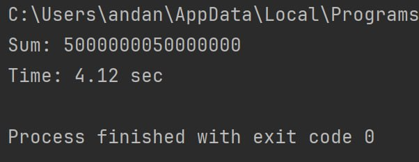
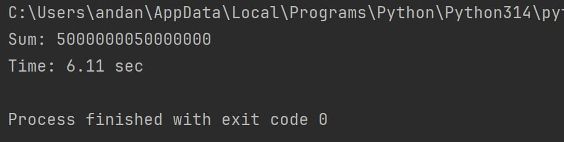
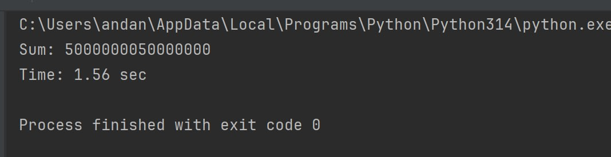
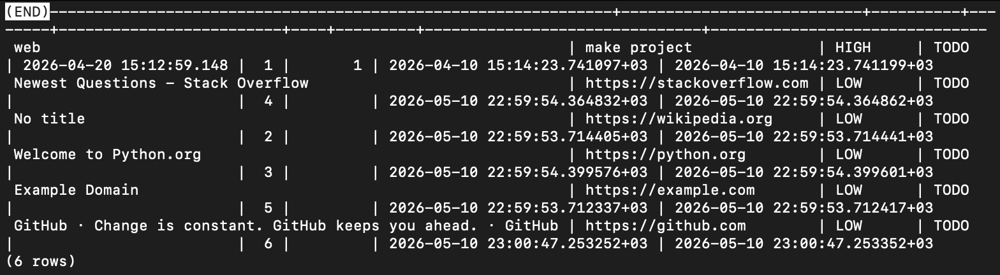

# Лабораторная работа 2. Потоки. Процессы. Асинхронность.

## Цели
Понять отличия потоками и процессами и понять, что такое ассинхронность в Python.

## Выполннение

### Часть 1: Различия между threading, multiprocessing и async в Python

### Общая логика и логика разделения задачи

Для демонстрации использовалось уменьшенное число (а именно 100_000_000), так как исходное значение требовало слишком большого времени вычислений.
Задача вычисления суммы чисел была разделена на 4 части, каждая из которых вычислялась в отдельном потоке:

```python
1--25000000
25000001--50000000
50000001--75000000
75000001--100000000
```

Каждая часть считается отдельно.
Потом результаты складываются.

### 1. THREADING

Для реализации выполнения задачи сложения с помощью многопоточности был написан файл threading_sum, где:
* threading.Thread() - создает поток;
* start() - Запускает поток;
* join() - Ждет завершения потока. Без него программа закончится раньше времени.

Для измерения времени выполнения использовался модуль time.

Threading — это механизм многопоточности в Python, позволяющий выполнять несколько задач параллельно внутри одного процесса.

В Python существует GIL (Global Interpreter Lock), из-за которого только один поток может выполнять Python bytecode одновременно.

Поэтому threading эффективен для I/O-bound задач, но малоэффективен для CPU-bound задач, какой и является данная задача.

#### Результат




#### Вывод

Подход threading не дал существенного ускорения вычислений, так как задача является CPU-bound и ограничивается GIL в Python.

### 2. ASYNCIO

AsyncIO — это библиотека Python для написания асинхронного кода.

Асинхронность позволяет эффективно выполнять множество операций ввода-вывода без создания потоков и процессов.

Работа основана на event loop и механизме await.

Была реализована программа с использованием asyncio.

Задача вычисления суммы была разделена на несколько асинхронных задач, которые запускались через asyncio.create_task() и объединялись с помощью asyncio.gather().

#### Результат



#### Вывод

AsyncIO не показал ускорения при вычислениях, так как асинхронность эффективна для I/O-bound задач, а не для CPU-bound вычислений.


### 3. MULTIPROCESSING

Multiprocessing — это механизм параллельного выполнения задач с помощью отдельных процессов.

Каждый процесс имеет собственный интерпретатор Python и собственный GIL, что позволяет эффективно использовать несколько ядер процессора.

Multiprocessing особенно эффективен для CPU-bound задач.

Была реализована программа с использованием multiprocessing.

Вычисление суммы было разделено между несколькими процессами. Каждый процесс вычислял сумму своей части диапазона и передавал результат через multiprocessing.Queue.

После завершения всех процессов результаты объединялись.

#### Результат



#### Вывод

Multiprocessing показал наилучшую производительность среди всех подходов, так как вычисления выполнялись параллельно на нескольких ядрах процессора.

### Вывод по 1 части

Для CPU-bound задач наиболее эффективным оказался multiprocessing, так как он использует несколько процессов и несколько ядер процессора.

Threading и asyncio не дали значительного ускорения из-за ограничений GIL и особенностей асинхронного выполнения.

### Часть 2.Параллельный парсинг веб-страниц с сохранением в базу данны

### 1. THREADING

Для реализации многопоточного парсинга использовался модуль threading. Для каждого URL создавался отдельный поток, который выполнял загрузку HTML-страницы, извлекал заголовок страницы и сохранял данные в базу PostgreSQL.

В качестве модели базы данных использовалась таблица Task из лабораторной работы №1. Заголовок страницы сохранялся в поле title, а URL страницы — в поле description.

#### Результат

В ходе выполнения были успешно обработаны следующие сайты:

- https://example.com
- https://python.org
- https://github.com
- https://stackoverflow.com
- https://wikipedia.org



После выполнения в таблице task появились новые записи с названиями страниц.

`Threading time: 57.995718240737915`

#### Вывод

Подход threading показал хорошую производительность 
для задач сетевого взаимодействия (I/O-bound), поскольку потоки могут ожидать ответы от серверов параллельно.

Недостатком threading является ограничение GIL (Global Interpreter Lock), из-за которого потоки не ускоряют CPU-bound вычисления, однако для сетевого парсинга этот подход является эффективным.

### 2. ASYNCIO

Программа состоит из трёх основных асинхронных компонентов:

1) main()
- создаёт HTTP-клиент (aiohttp.ClientSession)
- запускает параллельные задачи через asyncio.gather
2) parse_page(session, url)
- выполняет HTTP GET запрос
- парсит HTML
- извлекает title
- вызывает сохранение в БД
3) save_task(title, url)
- создаёт запись Task
- сохраняет в БД через AsyncSession


Асинхронный подход позволяет выполнять множество I/O операций (HTTP-запросы и работа с БД) без блокировки основного потока выполнения. Вместо создания потоков используется event loop, который переключается между задачами при ожидании операций ввода-вывода.

Все URL обрабатываются конкурентно с помощью asyncio.gather(), что позволяет запускать несколько HTTP-запросов одновременно в одном потоке.

При выполнении возникали ошибки SSL-сертификатов при подключении к некоторым сайтам (GitHub, StackOverflow). Проблема решена отключением проверки SSL через TCPConnector(ssl=False).

`Async time: 0.7569191455841064`


#### Вывод

Асинхронный подход показал высокую эффективность при работе с I/O-bound задачами, такими как HTTP-запросы и запись в базу данных. Использование asyncio позволило обрабатывать несколько веб-страниц одновременно без создания потоков или процессов, что снизило накладные расходы и ускорило выполнение программы.

### 3. MULTIPROCESSING

Для реализации многопроцессного парсинга использовался модуль multiprocessing.
Для каждого URL создавался отдельный процесс, который независимо выполнял загрузку HTML-страницы, извлечение заголовка и сохранение данных в базу данных PostgreSQL.

Каждый процесс выполнял свою задачу параллельно на уровне операционной системы, что позволило использовать несколько ядер процессора.

Передача данных в базу осуществлялась через отдельные подключения SQLAlchemy в каждом процессе.

В ходе выполнения были обработаны следующие сайты:

- https://example.com
- https://python.org
- https://github.com
- https://stackoverflow.com

После выполнения в таблице task появились новые записи с заголовками страниц.

`Multiprocessing time: 38.849589109420776`

#### Вывод

Многопроцессный подход обеспечивает реальную параллельность выполнения за счёт создания независимых процессов, каждый из которых имеет собственный интерпретатор Python и не зависит от GIL (Global Interpreter Lock).

Однако в данной задаче multiprocessing показал меньшую эффективность по сравнению с асинхронным подходом, так как:

создание процессов имеет значительные накладные расходы;
каждая операция включает сетевые запросы (I/O-bound задача), для которых multiprocessing не является оптимальным;
дополнительные затраты возникают на сериализацию и управление процессами.

Таким образом, multiprocessing наиболее эффективен для CPU-bound задач, тогда как для сетевого парсинга он уступает asyncio.

## Общий вывод

Были реализованы три подхода к параллельному выполнению задач в Python: многопоточность (threading), асинхронность (asyncio) и многопроцессность (multiprocessing).

Для CPU-bound задачи (вычисление суммы чисел) наилучший результат показал multiprocessing, так как он использует несколько ядер процессора и не ограничен GIL.

Для I/O-bound задачи (парсинг веб-страниц) наиболее эффективным оказался asyncio, так как он позволяет обрабатывать множество сетевых запросов в одном потоке без создания дополнительных потоков и процессов.

Threading показал промежуточные результаты и оказался наименее эффективным из трёх подходов из-за ограничений GIL.

Таким образом, выбор подхода зависит от типа задачи:

CPU-bound → multiprocessing

I/O-bound → asyncio

threading → ограниченно эффективен, чаще используется для простых I/O задач

Таким образом, выбор подхода напрямую зависит от типа решаемой задачи и характера нагрузки.

## Сравнение времени выполнения

| Подход          | Задача суммы чисел (CPU-bound) | Парсинг веб-страниц (I/O-bound) |
|-----------------|----------------------------------|----------------------------------|
| threading       | 4.12 сек                         | 57.99 сек                        |
| asyncio         | 6.11 сек                         | 0.75 сек                         |
| multiprocessing | 1.56 сек                         | 38.85 сек                        |